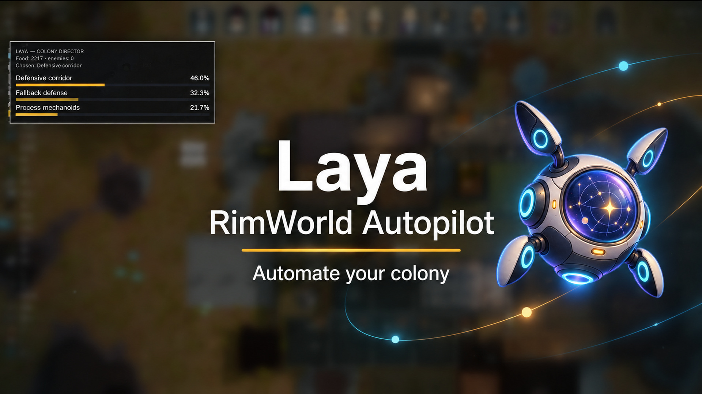
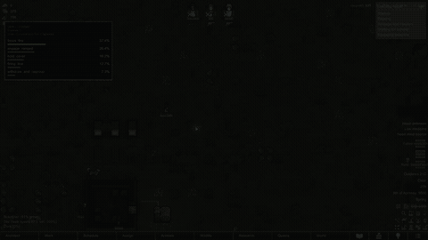
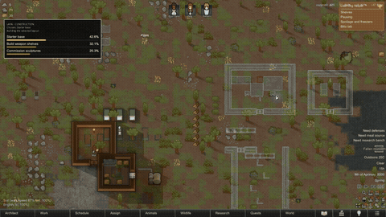
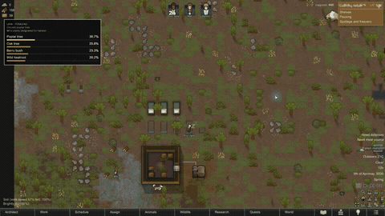

# RimWorld Autopilot




**Hand Laya the keys to your colony.** It reads the map, picks what matters next, and gives real in-game orders—from getting dinner on the table to sending a caravan or rallying everyone for a raid. Watch what it considered in the game, change its priorities in the desktop app, and see where the colony goes.

**[Download for Windows](https://github.com/Georgy-hook/rimworld-autopilot/releases/latest/download/RimWorld-Autopilot-Installer.exe)** · [Quick install](#quick-install) · [Explore the features](#what-laya-can-do) · [Latest release](https://github.com/Georgy-hook/rimworld-autopilot/releases/latest)

## See Laya at work

| Combat | Building |
|:--:|:--:|
|  |  |
| Harvest | Care |
|  |  |

The yellow bars show how Laya weighs the choices in front of it. The same view is available in the optional in-game overlay, while the desktop app keeps a history of decisions you can review and export.

## What Laya can do

### Feed the colony

- Turn scattered starting supplies into a working food system: open forbidden stacks, set up storage, cook, butcher, hunt, and gather wild plants.
- Choose crops with the season and coming temperatures in mind, then keep fields productive as conditions change.
- Grow storage as the colony grows, from stockpiles and shelves to a powered freezer when the materials are ready.

### Build a place worth living in

- Choose a settlement style—compact base, courtyard, private houses, or a mountain home—and develop it over time.
- Design rooms from the materials actually available. Laya picks the purpose, wall material, entrance, and layout; 24 residential designs and seeded variations keep homes from looking identical.
- Add bedrooms, kitchens, dining rooms, workshops, hospitals, prisons, temples, throne rooms, nurseries, barns, warehouses, and defenses as the colony needs them.
- Improve the details that make rooms work: light, temperature, floors, cleanliness, sculpture, hospital beds, and later equipment such as vital monitors.
- Keep production moving from simple work spots to better benches and new technology without tearing down useful equipment too early.

### Put people and animals to work

- Match jobs to colonists' skills, passions, traits, work restrictions, and injuries; make room for training and specialist roles.
- Adjust schedules for Night Owls and other needs while Laya decides where the workforce matters most.
- Feed, rescue, house, tame, and breed animals, with sleeping places and climate-aware barns when they make sense.
- Handle the less glamorous jobs too: corpse storage, graves or cremation, stone chunks beside the stonecutter, and hauling priorities.

### Earn, trade, and travel

- Pick an economic direction: clothing, sculptures, crops, livestock, drugs, chemfuel, stone blocks, valuable minerals, and other RimWorld goods.
- Trade with visitors and passing orbital ships, or send a caravan to a settlement Laya chooses from the reachable options.
- Weigh diplomacy, quests, prisoner recruitment or release, and RimWorld's darker income routes, including organ trade.
- Form rescue expeditions for kidnapped colonists and plan supplies and home defense before a caravan leaves.

### Fight for the colony

- Plan defenses around cover, doors, traps, turrets, mortars, firefoam, and fallback positions already on the map.
- Compare 36 situational combat tactics for mixed melee and ranged squads, from focus fire and bounded kiting to regrouping, EMP, smoke, and careful advances into range.
- Choose who fights using each pawn's weapon, skill, health, movement, and current injuries; coordinate fighters as a group while threats change.
- Respond to raids, insect infestations, mechanoids, kidnappers, psycast opportunities, and the sealed risk of an Ancient Danger.

### Keep a long-term direction

- Choose among 30 Core and DLC-aware colony directions, then shape research, building, work, trade, diplomacy, and endgame goals around that course.
- Reconsider the plan when resources, seasons, new technology, or events change the colony's situation.
- Bring your own priorities to the desktop app, review Laya's choices, export the history, and switch the in-game overlay on or off. The interface is available in English and Russian.
- Turn on the optional Stream Observer for an unattended broadcast: the camera follows colonists, fights and fresh raids, pauses on a death with its reported cause, and tours the map between events.

## Quick install

You need **64-bit Windows 10 (version 1809 or newer) or Windows 11**, **RimWorld 1.6**, **Harmony**, and **Python 3.10–3.12**. An NVIDIA GPU is recommended for faster decisions; CPU mode is available. The first setup downloads Laya's model files, so it needs an internet connection and free disk space.

1. Download and run the [latest Windows installer](https://github.com/Georgy-hook/rimworld-autopilot/releases/latest/download/RimWorld-Autopilot-Installer.exe). Choose your install folder and whether you want a desktop shortcut.
2. On the final setup page, leave **Configure Python, the local model and the RimWorld mod now** selected. The assistant finds RimWorld, prepares the Python environment, downloads Laya, and installs the bundled RIMAPI mod.
3. In RimWorld's mod list, enable **Harmony** before **RIMAPI — RimWorld Autopilot**, then restart the game.
4. Load a colony, open **RimWorld Autopilot**, and click **Start Laya**. Use **Stop** in the app whenever you want to take over again.

Windows may identify the installer as an unknown publisher because this open-source build is unsigned. Download it from the [GitHub release](https://github.com/Georgy-hook/rimworld-autopilot/releases/latest) and check the file before running it. A copy of your save is a good starting point for trying new priorities.

The first setup fetches the public `convaiinnovations/laya` checkpoint; later runs use the local cache. If the cache is empty, the app can download the files again. Model weights are not packed into the installer.

### Uninstalling

Use **Windows Settings → Apps → Installed apps → RimWorld Autopilot → Uninstall**, the Start-menu uninstall shortcut, or the uninstall button in the app. Windows removes the installed program and shortcuts. It keeps your logs and preferences under `%LOCALAPPDATA%\RimWorld Autopilot`, the Hugging Face model cache, and the RimWorld mod folder. The setup assistant may also leave its generated `.venv` and configuration in the install folder; remove those manually if you no longer need them.

## How it works

The bundled RIMAPI mod reads live game state and accepts ordinary game commands on a local connection. The Python director turns that state into a short list of feasible moves, including their costs and consequences. Laya chooses a direction, an action, and—only when needed—the action's target or parameters. The bridge checks the choice against the current map before sending it back to RimWorld.

That hierarchy keeps decisions focused. If Laya skips hunting, it is not asked to choose prey. If it decides to build, it can choose the room, material, entrance, and generated layout. In battle, it sees the available fighters and opposing force before choosing a tactic and roster. The HUD bars compare the options offered at that moment.

The control center shows the current colony direction, recent decisions, priorities, and connection health. It also offers a technical log view and a way to export decision history. See [Laya architecture and evaluation](docs/LAYA_ARCHITECTURE.md) for the model interface and [architecture](ARCHITECTURE.md) for the full project layout.

For a Twitch broadcast, open **Stream** in the control center and turn on **Observer**. It directs the camera, resumes game pauses and restores 3× speed after raids slow the game; Laya's colony decisions remain separate. Camera shot lengths stay in real seconds. Turn it off before pausing to inspect the game yourself. The [observer guide](docs/STREAM_OBSERVER.md) explains the shot order and standalone script.

### Data and privacy

Inference runs on your machine. The assistant downloads model files from Hugging Face during setup, then uses the local cache. RIMAPI communicates over loopback; keep its port `8765` local. Logs and preferences are stored locally, and exported history can contain pawn names and colony details.

## For contributors

The main parts are the [Python director](colony_director.py), [combat logic](colony_combat.py), [procedural architecture](colony_architect.py), [desktop interface](laya_gui/), and the [modified RIMAPI source](vendor/RIMAPI/Source/RIMAPI/). The [direction audit](DIRECTION_AUDIT.md), [GUI notes](GUI.md), and [RIMAPI changes](CUSTOM-RIMAPI.md) go deeper into each area.

To work from source on Windows with Python 3.12:

```powershell
py -3.12 -m venv .venv
.\.venv\Scripts\python.exe -m pip install -r requirements.txt
.\.venv\Scripts\python.exe -m unittest discover -s tests -q
```

To build the modified RimWorld 1.6 mod, use the .NET 8 SDK:

```powershell
dotnet build vendor\RIMAPI\Source\RIMAPI\RimApi.csproj -c Release-1.6
```

To build the Windows app, ZIP, and installer, install Inno Setup 6.7+ and run:

```powershell
.\Build-GUI.ps1
```

The build also creates `dist/RimWorld-Autopilot-Installer.exe`, an identical copy of the full versioned installer. Attach that fixed-name file to every stable release so the [permanent download link](https://github.com/Georgy-hook/rimworld-autopilot/releases/latest/download/RimWorld-Autopilot-Installer.exe) keeps working. See the [release checklist](docs/RELEASING.md).

The installer uses the compiled RIMAPI assembly in `vendor/RIMAPI/1.6/Assemblies`. For a manual install or preview run, see [Install.ps1](Install.ps1), [Start-Preview.ps1](Start-Preview.ps1), and [Start-Autonomous.ps1](Start-Autonomous.ps1). Changes by version are in [release notes](RELEASE_NOTES.md).

## Open-source thanks

RimWorld Autopilot builds on the work of [Convai Innovations and the Laya contributors](https://github.com/NandhaKishorM/laya), [Ilya Chichkov / RedEyeDev and RIMAPI contributors](https://github.com/IlyaChichkov/RIMAPI), [Andreas Pardeike and Harmony contributors](https://github.com/pardeike/HarmonyRimWorld), [Hugging Face Transformers](https://github.com/huggingface/transformers), [PyTorch](https://github.com/pytorch/pytorch), and the RimWorld modding community. See [third-party notices](THIRD_PARTY_NOTICES.md) for licenses and attribution.

This repository is licensed under [GPL-3.0](LICENSE). Laya's model and SDK keep their own Apache-2.0 license and are downloaded separately. RimWorld is a trademark of Ludeon Studios; this is an unofficial community project.
